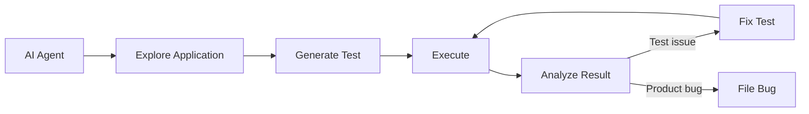

# Autonomous Testing & AI Agents

**Type**: Reference
**Difficulty**: ⭐⭐⭐⭐ (Advanced)
**Domain**: Test Automation Tooling Landscape
**Concept Group**: AI-Powered Test Automation
**Created**: 2026-08-23
**Tags**: autonomous-testing, ai-agents, self-healing, emerging

🧭 Mental model

<svg viewBox="0 0 780 240" role="img" aria-labelledby="mm-autoag-title mm-autoag-desc">
<title id="mm-autoag-title">A closed exploration-to-fix loop with a human gate on its riskiest step</title>
<desc id="mm-autoag-desc">An agent explores the application, generates a test, executes it, and analyzes the result. Fixing the test or filing a bug loops back into execution — this fix/file step is the riskiest in the loop and stays behind a human review gate.</desc>
<defs>
  <marker id="mm-autoag-arrow" viewBox="0 0 10 10" refX="8.5" refY="5" markerWidth="7" markerHeight="7" orient="auto-start-reverse">
    <path d="M0,0 L10,5 L0,10 z" class="mm-arrowhead"/>
  </marker>
</defs>

<rect class="mm-n2" x="20" y="20" width="150" height="55" rx="10"/>
<text class="mm-node-title" x="95" y="44" text-anchor="middle">Explore</text>
<text class="mm-node-sub" x="95" y="61" text-anchor="middle">navigate the app</text>

<path class="mm-arrow" d="M170,47 L200,47" marker-end="url(#mm-autoag-arrow)"/>

<rect class="mm-n3" x="200" y="20" width="150" height="55" rx="10"/>
<text class="mm-node-title" x="275" y="44" text-anchor="middle">Generate</text>
<text class="mm-node-sub" x="275" y="61" text-anchor="middle">draft the test</text>

<path class="mm-arrow" d="M350,47 L400,47" marker-end="url(#mm-autoag-arrow)"/>

<rect class="mm-n4" x="400" y="20" width="150" height="55" rx="10"/>
<text class="mm-node-title" x="475" y="44" text-anchor="middle">Execute</text>
<text class="mm-node-sub" x="475" y="61" text-anchor="middle">run it</text>

<path class="mm-arrow" d="M550,47 L600,47" marker-end="url(#mm-autoag-arrow)"/>

<rect class="mm-n5" x="600" y="20" width="150" height="55" rx="10"/>
<text class="mm-node-title" x="675" y="44" text-anchor="middle">Analyze</text>
<text class="mm-node-sub" x="675" y="61" text-anchor="middle">test issue or product bug?</text>

<path class="mm-arrow" d="M660,75 L610,140" marker-end="url(#mm-autoag-arrow)"/>

<rect class="mm-n1" x="420" y="140" width="260" height="55" rx="10"/>
<text class="mm-node-title" x="550" y="164" text-anchor="middle">Fix Test / File Bug</text>
<text class="mm-node-sub" x="550" y="181" text-anchor="middle">human review gate</text>

<path class="mm-arrow" d="M450,140 C 380,100 420,90 465,78" marker-end="url(#mm-autoag-arrow)"/>

<text class="mm-flow-label" x="300" y="130" text-anchor="middle">fix loops back into execution —</text>
<text class="mm-flow-label" x="300" y="144" text-anchor="middle">the riskiest step, kept human-gated</text>
</svg>

The loop explores, generates, executes, and analyzes with little human involvement, but the fix-or-file step feeds back into execution and is where an unsupervised mistake compounds fastest — which is why it stays behind a human gate even in an otherwise automated pipeline.

## Quick Reference

Autonomous testing — an AI agent that explores an application, generates a test, executes it, analyzes the result, fixes the test or files a bug, and re-runs, with minimal human involvement — is the frontier and the least mature capability in this domain. It's worth piloting narrowly, not adopting as a default practice for production-critical systems yet.

## What is it?

Autonomous testing combines every other AI testing capability ([Generation](./ai-test-generation.md), [Maintenance](./ai-test-maintenance.md), [Failure Analysis](./ai-test-failure-analysis.md), [Root Cause Analysis](./ai-root-cause-analysis.md)) into a closed loop with reduced human-in-the-loop review at each step. It's emerging (not mature) — active vendor investment and internal experimentation, not yet an industry-standard, low-risk practice.

## Core Concepts

| Loop Stage | Maturity |
|---|---|
| **Explore** | Emerging — agents can navigate an app, but coverage depends heavily on exploration strategy |
| **Generate** | Mature (as a supervised capability) — see [AI Test Generation](./ai-test-generation.md) |
| **Execute** | Mature — standard test execution infrastructure |
| **Analyze** | Maturing — see [AI Test Failure Analysis](./ai-test-failure-analysis.md) |
| **Fix / File** | Emerging, higher-risk — autonomous test modification without review is the riskiest step in the loop |

## When to Use

- Piloting exploratory test generation on a low-stakes, non-production-critical application
- Evaluating vendor claims about autonomous testing platforms with a scoped, measured trial rather than a wholesale adoption
- Generating a broad first pass of exploratory coverage on an application with little to no existing test coverage, as a starting point for human refinement

## Recommended Stack

Not a recommended default stack yet — this is explicitly the emerging tier. Where piloted, keep a human review gate on the "fix test" and "file bug" steps specifically, since those are where an autonomous loop's mistakes compound fastest and are hardest to catch after the fact.

## Summary

- 💡 Autonomous testing is the least mature capability covered in this domain — treat vendor claims with proportionate skepticism and pilot narrowly before trusting broadly
- 🔥 Coverage illusion is the central risk — an agent that autonomously generates a large volume of tests can create the appearance of thorough coverage while testing shallow, low-value paths
- ⚠️ An agent exploring an app doesn't inherently know intended versus current (possibly buggy) behavior, and can bake bugs into assertions as if they were correct — the same risk as generation, compounded by reduced human review
- ✅ Keep the "fix test" and "file bug" steps behind a human review gate even in an otherwise automated loop — this is the highest-leverage place to retain oversight
- ⚡ Non-determinism compounds when an autonomous agent operates on a system that also has normal test flakiness, producing hard-to-debug behavior if not carefully bounded

## Common Mistakes

**Mistake**: Adopting a fully autonomous, unsupervised testing loop for a production-critical system based on vendor marketing claims.
**Why it fails**: The technology is genuinely emerging — unsupervised operation on a production-critical system carries real risk the current maturity level doesn't yet justify.

**Mistake**: Measuring an autonomous testing pilot's success purely by the number of tests generated.
**Why it fails**: Test count isn't test value — a pilot generating hundreds of shallow tests looks successful by that metric while providing little real coverage improvement.

## Advanced Usage

### Scoping a safe pilot

Run an autonomous exploration/generation loop against a staging (not production) environment, with a human reviewing every generated test before it enters the permanent suite, and explicitly measure whether the generated tests catch real, previously-unknown issues versus restating known behavior.

## Scenarios & How to Respond

**Scenario: A vendor pitches a fully autonomous testing platform as a replacement for the SDET team.**
Audience & tone: Leadership/stakeholder — grounded, not dismissive of the technology's direction.
Response: "The exploration and generation pieces are genuinely useful and worth piloting — the autonomous fix/file steps are where I'd want a human gate, since that's where an unsupervised mistake compounds fastest. I'd propose a scoped pilot on a non-critical app before considering anything broader."

## See Also

- [AI Test Generation](./ai-test-generation.md)
- [AI Test Failure Analysis](./ai-test-failure-analysis.md)
- [Future of Test Automation](./future-of-test-automation.md)

---

**Related Records**: AI Test Generation, AI Test Failure Analysis, Future of Test Automation
