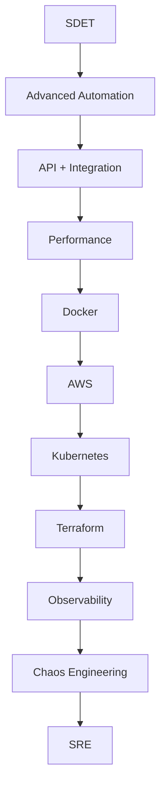

# SDET → SRE Transition

**Type**: Workflow
**Difficulty**: ⭐⭐⭐⭐ (Advanced)
**Domain**: Test Automation Tooling Landscape
**Concept Group**: Building Your Tooling Roadmap
**Created**: 2026-08-23
**Tags**: sdet-to-sre, career-transition, sre, observability, chaos-engineering

🧭 Mental model

<svg viewBox="0 0 780 260" role="img" aria-labelledby="mm-sdetsre-title mm-sdetsre-desc">
<title id="mm-sdetsre-title">The same instinct, applied pre-production and to the live system, bridged by chaos engineering</title>
<desc id="mm-sdetsre-desc">Defining "correct" precisely and verifying it continuously is the shared instinct behind both roles. SDET applies it pre-production through assertions and fixtures; SRE applies it to the live system through SLIs and on-call — chaos engineering is the clearest bridge between the two.</desc>
<defs>
  <marker id="mm-sdetsre-arrow" viewBox="0 0 10 10" refX="8.5" refY="5" markerWidth="7" markerHeight="7" orient="auto-start-reverse">
    <path d="M0,0 L10,5 L0,10 z" class="mm-arrowhead"/>
  </marker>
</defs>

<rect class="mm-n6" x="290" y="15" width="200" height="55" rx="10"/>
<text class="mm-node-title" x="390" y="38" text-anchor="middle">Same Core Instinct</text>
<text class="mm-node-sub" x="390" y="54" text-anchor="middle">define correct → verify continuously</text>

<path class="mm-arrow" d="M340,70 L190,120" marker-end="url(#mm-sdetsre-arrow)"/>
<path class="mm-arrow" d="M440,70 L590,120" marker-end="url(#mm-sdetsre-arrow)"/>

<rect class="mm-n2" x="40" y="120" width="300" height="60" rx="10"/>
<text class="mm-node-title" x="190" y="144" text-anchor="middle">SDET: Pre-Production</text>
<text class="mm-node-sub" x="190" y="161" text-anchor="middle">assertions, fixtures, CI/CD</text>

<rect class="mm-n4" x="440" y="120" width="300" height="60" rx="10"/>
<text class="mm-node-title" x="590" y="144" text-anchor="middle">SRE: Live System</text>
<text class="mm-node-sub" x="590" y="161" text-anchor="middle">SLIs, alerting, on-call</text>

<path class="mm-arrow" d="M190,182 C 300,230 480,230 588,182" marker-end="url(#mm-sdetsre-arrow)"/>
<text class="mm-flow-label" x="390" y="222" text-anchor="middle">chaos engineering: the clearest bridge skill</text>
</svg>

The transition isn't a pivot into an unrelated discipline — it's the same "define correct, verify continuously" instinct redirected from pre-production assertions to a live system's SLIs, with chaos engineering as the practice that bridges both.

## Quick Reference

The core transferable instinct is the same in both roles: define what "correct/healthy" means precisely enough to verify it automatically, then build the tooling and telemetry to check it continuously. SDET applies that instinct pre-production; SRE applies it to the live system — which is why this transition is a well-trodden, low-friction path rather than a career pivot into an unrelated discipline.

## What is it?

SDET → SRE is the specific, sequenced transition from test-automation-focused engineering into reliability engineering — Service Level Objectives (SLOs), incident response, capacity planning, and production ownership. It's distinct from the general [SDET Career & Skill Roadmap](./sdet-career-skill-roadmap.md) in that it's a roadmap toward a specific destination role, not a general skill-breadth plan.

## How Skills Transfer

| SDET Skill | SRE Application |
|---|---|
| Writing assertions against system behavior | Writing SLIs (Service Level Indicators) and alerting rules against the same telemetry |
| Designing test environments and fixtures | Designing staging/canary environments and synthetic monitoring |
| Performance testing (k6, load/stress/soak) | Capacity planning and performance engineering |
| Chaos/resilience testing | Incident response readiness, game days, failure-mode analysis |
| Infrastructure testing (Terratest, Checkov) | Infrastructure reliability and change-management review |
| CI/CD pipeline design | Deployment pipelines, progressive delivery, rollback automation |
| Root cause analysis of test failures | Incident root cause analysis and postmortems |
| Observability-driven test assertions | SLO/SLA/SLI definition and error-budget management |

## When to Use

- Actively planning a move from an SDET role into an SRE-titled role
- Evaluating how much of an SRE job posting's requirements you already meet through SDET experience
- Structuring a 12–18 month personal development plan with SRE as the explicit target

## Recommended Stack

Each stage's tooling depends on comfort with the one before it — chaos engineering without observability fluency produces experiments nobody can interpret; observability without Kubernetes/cloud fluency produces dashboards nobody can act on.

## Key Takeaways

- 💡 SDET and SRE aren't different disciplines wearing different job titles — they're the same underlying instinct (define correct, verify continuously) applied to different points in the system's lifecycle
- 🔥 Chaos engineering is the clearest overlap point — it's simultaneously an advanced test automation practice and a core SRE discipline, making it a natural bridge skill to prioritize
- ⚠️ Skipping straight to chaos engineering or SLO ownership without observability fluency first produces experiments and targets nobody can act on meaningfully
- ✅ Incident response and postmortem skills transfer directly from root-cause analysis practice built as an SDET — the muscle is the same, the artifact (a postmortem vs. a bug report) differs
- ⚡ On-call experience, even informally shadowing an SRE rotation, accelerates this transition faster than any additional tool study — the judgment SRE requires is built under real incident pressure, not in a tutorial

## Common Mistakes

**Mistake**: Treating this transition as primarily about learning Kubernetes and Terraform, with observability and incident response as an afterthought.
**Why it fails**: Infrastructure fluency without observability and incident-response practice produces someone who can provision a cluster but can't diagnose why it's unhealthy — the actual core of SRE work.

**Mistake**: Waiting until every stage of the roadmap is "complete" before seeking any SRE-adjacent responsibility.
**Why it fails**: Real SRE judgment is built through exposure to real production ownership — shadowing on-call or taking a reliability-focused project earlier in the roadmap accelerates learning that pure study can't replicate.

## Advanced Usage

### Using chaos engineering as a transition accelerant

Volunteer to lead or co-design a chaos engineering game day — it's simultaneously a legitimate test automation deliverable and direct, hands-on SRE practice (hypothesis formation, blast-radius scoping, incident-response-style observation), making it one of the highest-leverage single projects in this transition.

## Scenarios & How to Respond

**Scenario: A direct report asks how to position themselves for an SRE role after several years as an SDET.**
Audience & tone: Direct report — mentoring, concrete next steps.
Response: "You already have the hardest part — the instinct to define 'correct' precisely and verify it automatically. The gap is usually infrastructure and observability fluency plus real incident exposure. I'd suggest starting with owning observability for one service you already test, then looking for a chance to shadow on-call."

## See Also

- [SDET Career & Skill Roadmap](./sdet-career-skill-roadmap.md)
- [Modern SRE Testing Stack](./modern-sre-testing-stack.md)
- [Chaos & Resilience Testing](../distributed-systems-resilience-testing/chaos-resilience-testing.md)

---

**Related Records**: SDET Career & Skill Roadmap, Modern SRE Testing Stack, Chaos & Resilience Testing
