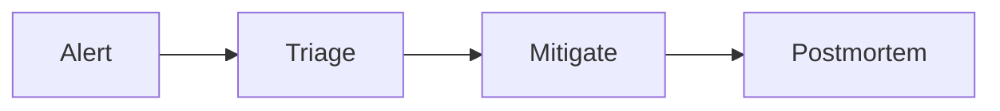

# Content model

Every content page is built from the same parts so a reader always knows where
to find the fast path, the practice, and the "how would I use this with AI"
angle. All components below are **global** — use them in any `.md` file with no
import.

## Frontmatter

Add `level` to every content page:

```yaml
---
title: "..."
description: "..."
level: beginner   # beginner | intermediate | advanced
tags: [...]
---
```

## Standard order

| Page type | Order |
| --- | --- |
| **Cheat sheet** | intro blurb → `<TenMinute>` → cheat cards → `<InterviewQuestions>` → `<Exercises>` → `<CaseStudy>` + `<AISpark>` → `<KnowledgeMap>` |
| **Topic guide** (`*-guide.md`) | intro → `<VisualExplanation>` → `<TenMinute>` → `<LearningPath>` → body with `<InteractiveExample>` per concept → `<InterviewQuestions>` → `<Exercises>` → `<CaseStudy>` + `<AISpark>` → `<Commentary>` (if it builds on an external idea) → `<KnowledgeMap>` |
| **Deep subtopic** | `<TenMinute>` (short) → body → `<InterviewQuestions>` (2–3) → `<Exercises>` (2) → `<CaseStudy>` + `<AISpark>` → `<KnowledgeMap>` |
| **Article** (`blog/`) | intro → `<KeyTakeaways>` → `<!-- truncate -->` → `<VisualExplanation>` → body → `<Commentary>` → `<CaseStudy>` + `<AISpark>` → References → Summary |

## Components

### `<TenMinute>`

```mdx
<TenMinute minutes={10}>

1. Do the smallest useful thing
2. Then the next

</TenMinute>
```

<TenMinute minutes={10}>

1. Do the smallest useful thing
2. Then the next

</TenMinute>

### `<LearningPath>`

```mdx
<LearningPath>
  <LearningPath.Stage level="beginner" outcome="Run and read a suite">

  - Install, first test, report

  </LearningPath.Stage>
  <LearningPath.Stage level="intermediate" outcome="Design a small framework">

  - Fixtures, config, CI

  </LearningPath.Stage>
</LearningPath>
```

<LearningPath>
  <LearningPath.Stage level="beginner" outcome="Run and read a suite">

  - Install, first test, report

  </LearningPath.Stage>
  <LearningPath.Stage level="advanced" outcome="Own the platform">

  - Sharding, flake budgets, dashboards

  </LearningPath.Stage>
</LearningPath>

### `<InteractiveExample>`

```mdx
<InteractiveExample title="..." sandboxUrl="https://...">
  <InteractiveExample.Concept>

  The idea, in prose.

  </InteractiveExample.Concept>
  <InteractiveExample.Demo runnable code={`console.log(2 + 2)`}>

  \`\`\`js
  console.log(2 + 2);
  \`\`\`

  </InteractiveExample.Demo>
</InteractiveExample>
```

### `<VisualExplanation>`

```mdx
<VisualExplanation summary="One paragraph a skimmer can stop at." caption="What the diagram shows">

<svg>...</svg>

</VisualExplanation>
```

### `<KnowledgeMap>`

```mdx
<KnowledgeMap groups={[
  {title: 'Official', links: [
    {label: 'Playwright docs', href: 'https://playwright.dev', note: 'Always current'},
  ]},
  {title: 'On this site', links: [
    {label: 'CI/CD Pipelines', href: '/cheatsheets/ci-cd-pipelines', note: 'Where tests run'},
  ]},
]} />
```

### `<Commentary>`

```mdx
<Commentary
  source={{title: 'The Test Pyramid', author: 'Martin Fowler', url: 'https://martinfowler.com/bliki/TestPyramid.html'}}
  references={[{label: 'Testing Trophy', href: 'https://kentcdodds.com/blog/write-tests'}]}>

My take: ...

</Commentary>
```

### `<InterviewQuestions>`

```mdx
<InterviewQuestions>
  <InterviewQuestions.Q question="What is auto-waiting?" level="beginner">

  Answer in markdown.

  </InterviewQuestions.Q>
</InterviewQuestions>
```

### `<Exercises>`

```mdx
<Exercises>
  <Exercises.Task title="First test" level="beginner" stretch="Run it in CI">

  Open the homepage, assert the title.

  </Exercises.Task>
</Exercises>
```

### `<CaseStudy>` + `<AISpark>`

```mdx
<CaseStudy title="The 2am flaky-suite page">
  <CaseStudy.Context>...</CaseStudy.Context>
  <CaseStudy.WhatHappened>...</CaseStudy.WhatHappened>
  <CaseStudy.Lesson>...</CaseStudy.Lesson>
</CaseStudy>

<AISpark>

- Paste a failing trace, ask for the 3 most likely causes ranked.
- Have an agent draft POM classes from a URL, then review selectors.

</AISpark>
```

### `<LevelBadge>` / `<TechIcon>`

```mdx
<LevelBadge level="intermediate" />
<TechIcon slug="playwright" size={20} tint />
```

### `<AdSlot>`

Renders nothing until AdSense is enabled in `src/data/site.js`. Place at most
one per page, after the first major section: `<AdSlot slot="1234567890" />`.

### Mermaid diagrams

Flowcharts, sequence diagrams, and state machines can be written as text in a
fenced `mermaid` block — no SVG needed. They follow the light/dark theme.
Prefer this for new diagrams; the hand-drawn SVG mental models stay as they are.

````md

````


### Comments

Docs and articles (not cheat sheets) show a Giscus comment thread at the
bottom once `GISCUS.repoId` and `GISCUS.categoryId` are set in
`src/data/site.js`. Until then nothing is rendered.
